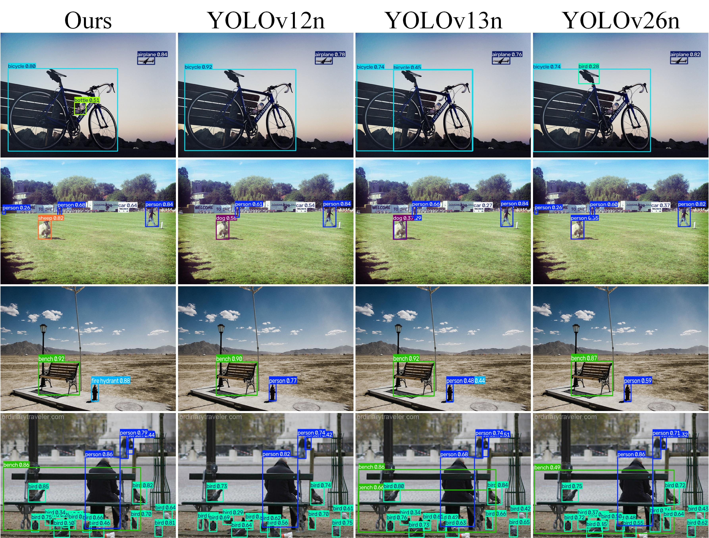

# YOLO_Comp
YOLO-Comp: Target-Relative Multi-Scale Compensation for Real-Time Object Detection

## Results
### 1. MS COCO Benchmark
Table 1. Quantitative comparison with other state-of-the-art real-time object detectors on the MS COCO dataset

| Model          | Params.(M) | FLOPs(G) | AP50:95val | AP50val | AP75val | Latency (ms) |
|----------------|------------|----------|----------------------------------|-------------------------------|-------------------------------|--------------|
| YOLOv10-N[26]  | 2.3        | 6.7      | 38.5                             | 53.8                          | 41.7                          | 1.84         |
| YOLOv11-N[8]   | 2.6        | 6.5      | 39.4                             | 55.3                          | 42.5                          | **1.52**     |
| YOLOv12-N[24]  | 2.6        | 6.5      | 40.6                             | 56.7                          | 43.8                          | 1.85         |
| YOLOv13-N[10]  | 2.5        | 6.4      | 41.6                             | 57.8                          | 45.1                          | 1.97         |
| YOLOv26-N[22]  | 2.6        | **5.4**  | 40.8                             | 56.9                          | 44.3                          | 1.72         |
| **YOLO-Comp-N**| 2.9        | 7.9      | **42.1**                         | **58.4**                      | **45.5**                      | 2.12         |
| YOLOv10-S[26]  | 7.2        | 21.6     | 46.3                             | 63.0                          | 50.4                          | 2.51         |
| YOLOv11-S[8]   | 9.4        | 21.5     | 46.9                             | 63.9                          | 50.6                          | 2.52         |
| YOLOv12-S[24]  | 9.3        | 21.4     | 48.0                             | 65.0                          | 51.8                          | 2.76         |
| YOLOv13-S[10]  | 9.0        | 20.8     | 48.0                             | 65.2                          | 52.0                          | 3.02         |
| YOLOv26-S[22]  | 9.5        | **20.7** | 46.5                             | 64.5                          | 51.7                          | 2.55         |
| **YOLO-Comp-S**| 10.6       | 27.2     | **48.7**                         | **66.1**                      | **52.8**                      | 3.10         |
| YOLOv10-M[26]  | 15.4       | 59.1     | 51.1                             | 68.1                          | 55.8                          | 4.74         |
| YOLOv11-M[8]   | 20.1       | 68.0     | 51.5                             | 68.5                          | 55.7                          | **4.70**     |
| YOLOv12-M[24]  | 20.2       | 67.5     | 51.5                             | 70.0                          | 57.1                          | 4.86         |
| YOLOv13-M[10]  | 21.3       | 67.9     | 52.2                             | 69.3                          | 57.1                          | 5.01         |
| YOLOv26-M[22]  | 20.4       | 68.2     | 52.1                             | 69.1                          | 56.5                          | 4.70         |
| **YOLO-Comp-M**| 23.1       | 84.9     | **53.0**                         | **70.8**                      | **57.5**                      | 5.11         |
| YOLOv10-L[26]  | 24.4       | 120.1    | 53.2                             | 70.1                          | 58.1                          | 7.33         |
| YOLOv11-L[8]   | 25.3       | 86.9     | 53.2                             | 70.1                          | 58.2                          | 6.25         |
| YOLOv12-L[24]  | 26.3       | 88.9     | 53.0                             | 70.0                          | 57.9                          | 6.89         |
| YOLOv13-L[10]  | 27.6       | 88.4     | 53.4                             | 70.9                          | 58.1                          | 8.23         |
| YOLOv26-L[22]  | 24.8       | **86.4** | 52.9                             | 69.8                          | 57.2                          | **6.21**     |
| **YOLO-Comp-L**| 29.3       | 106.5    | **53.8**                         | **71.1**                      | **58.5**                      | 8.42         |

## 2. Visualizations

